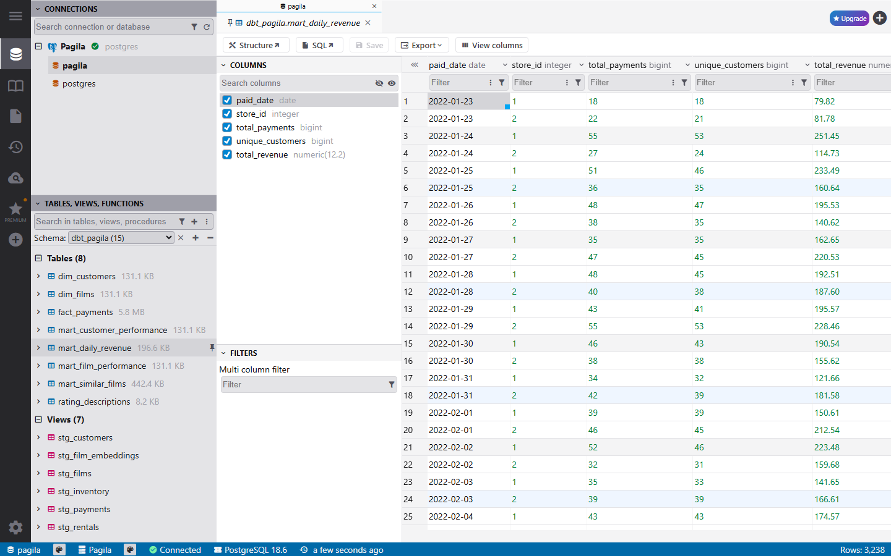
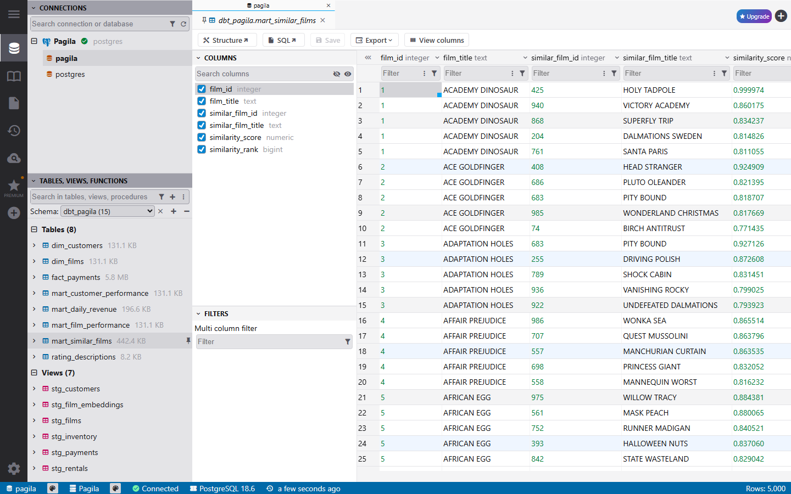
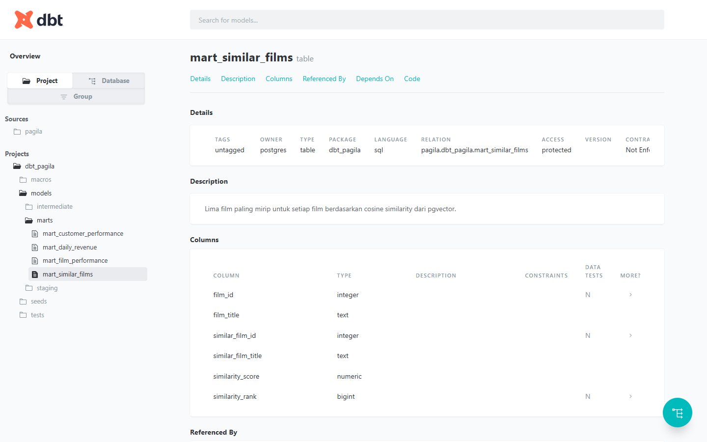

# dbt Pagila Project

Project ini menggunakan database Pagila sebagai source PostgreSQL untuk membangun alur transformasi data dengan dbt.

Data raw tetap berada di schema `public`. Model dbt kemudian membentuk layer staging, dimensional/fact, dan mart di schema `dbt_pagila`.

Selain model customer, payment, revenue, dan film, project ini juga memakai `film_embedding` dari Pagila untuk membuat rekomendasi 5 film paling mirip dengan pgvector.

## Stack

- PostgreSQL 18
- pgvector
- dbt Core
- Docker Compose
- DbGate

## Alur data

```text
Pagila (public)
      |
      v
   staging
      |
      v
dimensional / fact
      |
      v
     marts
```

Alur utama:

```text
customer / rental / payment / film / inventory / store
                         |
                         v
                     staging
                         |
                         v
        dim_customers / dim_films / fact_payments
                         |
                         v
 customer performance / daily revenue / film performance
```

Cabang vector tetap memakai layer yang sama dan tidak membuat ulang data film:

```text
film_embedding
      |
      v
stg_film_embeddings
      |
      v
mart_similar_films
```

## Model

### Staging

Staging dibuat sebagai view untuk merapikan nama kolom, timestamp, dan tipe data sebelum dipakai model berikutnya.

- `stg_customers`
- `stg_rentals`
- `stg_payments`
- `stg_films`
- `stg_inventory`
- `stg_stores`
- `stg_film_embeddings`

### Dimensional dan fact

- `dim_customers` - ringkasan aktivitas rental dan pembayaran per customer
- `dim_films` - metadata film, kategori, inventory, dan aktivitas rental
- `fact_payments` - transaksi pembayaran yang sudah dilengkapi informasi customer, store, rental, dan film

### Mart

- `mart_customer_performance` - ringkasan aktivitas customer
- `mart_daily_revenue` - revenue harian per store
- `mart_film_performance` - aktivitas rental dan revenue per film
- `mart_similar_films` - 5 film paling mirip untuk setiap film berdasarkan cosine similarity

## Hasil di database

Semua hasil transformasi dbt dibuat di schema `dbt_pagila`.

### Daily revenue

`mart_daily_revenue` merangkum jumlah payment, customer unik, dan revenue berdasarkan tanggal serta store.



### Film similarity

`mart_similar_films` berisi 5 film terdekat untuk setiap film berdasarkan vector embedding dari Pagila.



## dbt Docs

Project juga bisa dilihat melalui dbt Docs untuk mengecek deskripsi model dan dependency antar-model.



Untuk generate dan membuka docs secara lokal:

```powershell
docker compose run --rm dbt dbt docs generate
docker compose run --rm -p 15480:8080 dbt dbt docs serve --host 0.0.0.0 --port 8080
```

Setelah itu buka:

```text
http://localhost:15480
```

## Menjalankan project

Jalankan PostgreSQL dan DbGate:

```powershell
docker compose up -d postgres dbgate
```

Pada database volume yang masih kosong, schema dan data Pagila akan dimuat otomatis dari `docker/init`.

Jalankan project dbt:

```powershell
docker compose run --rm dbt dbt build
```

DbGate bisa dibuka di:

```text
http://localhost:15424
```

Service dbt dijalankan saat dibutuhkan, sedangkan PostgreSQL dan DbGate bisa tetap berjalan sebagai service Docker.

## Struktur project

```text
.
|-- docker/
|   |-- dbt/
|   `-- init/
|-- docs/
|   `-- images/
|-- macros/
|-- models/
|   |-- staging/
|   |-- intermediate/
|   `-- marts/
|-- seeds/
|-- tests/
|-- dbt_project.yml
|-- docker-compose.yml
`-- profiles.yml
```

## Sumber data

Dataset menggunakan Pagila:

https://github.com/devrimgunduz/pagila
